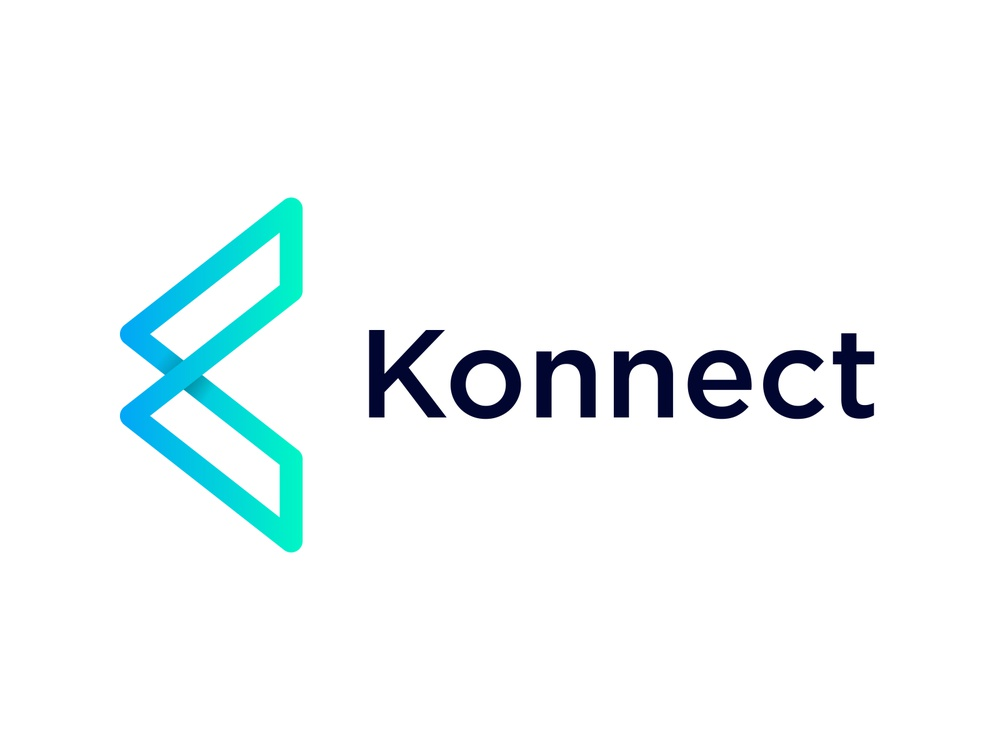
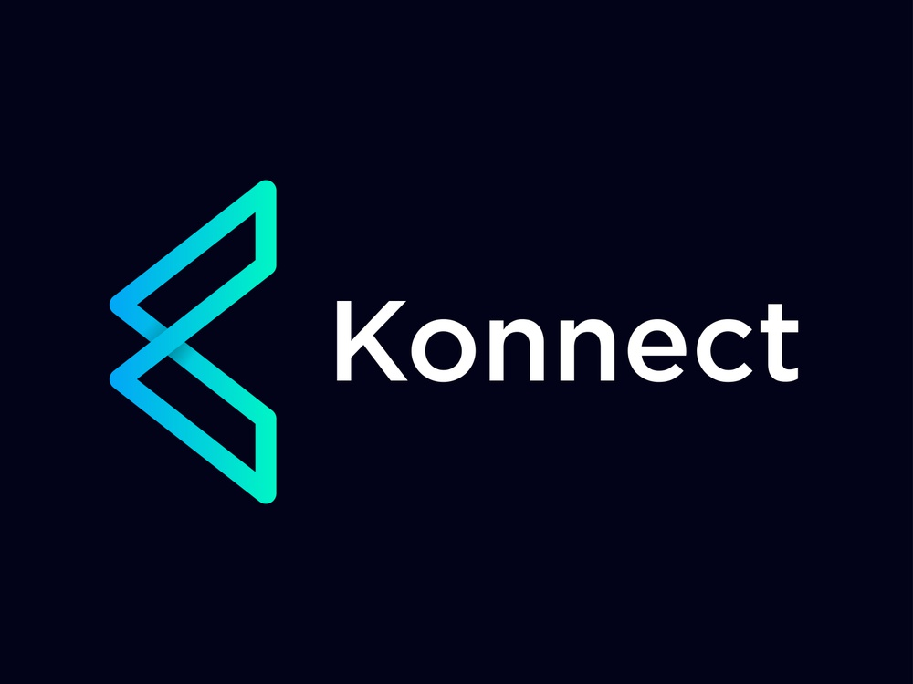

<!-- PROJECT LOGO -->
<p align="center">
  <a href="https://github.com/YunusEmreAlps/Konnect">
    
  </a>
</p>


<!-- ABOUT THE PROJECT -->
## What is Konnect?
Konnect is a messaging app for simple private communication with friends.

Say "hello" to a different messaging experience. An unexpected focus on privacy, combined with all of the features you expect.

• Go fast – Messages are delivered quickly and reliably, even on slow networks. Konnect is optimized to operate in the most constrained environment possible.<br/>
• Be yourself – You can use your existing phone number and address book to securely communicate with your friends.<br/>
• Speak up – Whether they live across town or across the ocean, Konnect’s enhanced audio and video quality will make your friends and family feel closer.<br/>

Simple. Secure. Reliable messaging. Online calls and messaging made easy

## Main Features

A chat app made by Flutter and Firebase. Support login with google account, chat with any user, send text and voice.

- Refactor the code
- Multiple users with separate chat channels
- Add server timestamp
- Longpresses audio rec like in whatsapp
- Use provider for managing state
- Already logged in to homepage
- TextInputField decoration like whatsapp
- Multiple Language (TR/EN)

!! When you were searching user for the first time, a target user must be online for the first conversation. App is working


## Folder structure
There's two different folders. Each of them is a Dart project.

* **core**: contains the pure Dart business logic, such API communication, Redux, XML parsing, sanitization, i18n, models and utilities. 
It also has a great test coverage.
* **ui**: this is the Flutter project. It imports **core**, and it's a 100% shared codebase for the native Android & iOS apps that go on app stores.

<!-- GETTING STARTED -->
## 🚀 Getting Started

### Prerequisites

To run any Android application built with Flutter you need to configure the enviroments in your machine, you can do this following the the tutorial provided by Google in [Flutter website](https://flutter.dev/docs/get-started/install)

- Flutter SDK
- Android Studio (to download Android SDK)
- Xcode (for iOS develop only)
- Any IDE with Flutter SDK installed (ie. IntelliJ, Android Studio, VSCode etc)
- A little knowledge of Dart and Flutter

### Clone

- Clone this repo to your local machine using:

```
git clone https://github.com/YunusEmreAlps/Konnect.git
```

### Setup

To run the app you need to have an online emulator or a plugged device and run the following command in the root of the application.

#### Android
```
flutter run
``` 
### iOS (_MAC Only_)

```
flutter run
``` 

<!-- ROADMAP -->
## Roadmap

See the [open issues](https://github.com/YunusEmreAlps/Konnect/issues) for a list of proposed features (and known issues).


<!-- CONTRIBUTING -->
## 🤔 Contributing (Feel free to contribute!)

Awesome! Contributions of all kinds are greatly appreciated. To help smoothen the process we have a few non-exhaustive guidelines to follow which should get you going in no time.

### Using GitHub Issues

- Feel free to use GitHub issues for questions, bug reports, and feature requests
- Use the search feature to check for an existing issue
- Include as much information as possible and provide any relevant resources (Eg. screenshots)
- For bug reports ensure you have a reproducible test case
  - A pull request with a breaking test would be super preferable here but isn't required

### Submitting a Pull Request

- Squash commits
- Lint your code with eslint (config provided)
- Include relevant test updates/additions

<!-- CONTACT -->
## 📌 Contact

- Linkedin at [Yunus Emre Alpu](https://www.linkedin.com/in/yunus-emre-alpu-5b1496151/)

<!-- LICENSE -->
## 📝 License

Distributed under the MIT License. See `LICENSE` for more information.


<!-- SCREENSHOTS -->
## Version 0.1.0 Screenshots

Login Page               | Chat Home Page             | Chat Page               | Chat Page
:-------------------------:|:-------------------------:|:-------------------------:|:-------------------------:
||||


## Version 0.1.1 Screenshots

Login Page               | Chat Home Page             | Chat Page               | Chat Page
:-------------------------:|:-------------------------:|:-------------------------:|:-------------------------:
||||

## Version 0.1.2 Screenshots

Launch Page               | Login Page             | Chat Page               | Chat Page
:-------------------------:|:-------------------------:|:-------------------------:|:-------------------------:
||||

## Version 0.1.3 Screenshots

Launch Icon               | Launch Page            | Login Page (EN)               | Login Page (TR)
:-------------------------:|:-------------------------:|:-------------------------:|:-------------------------:
||||

Add User (EN)              | Add User (TR)              | Chat Page (EN)               | Chat Page (TR)
:-------------------------:|:-------------------------:|:-------------------------:|:-------------------------:
||||

<p align="center">
  <a href="https://github.com/YunusEmreAlps/Konnect">
    
  </a>
</p>
